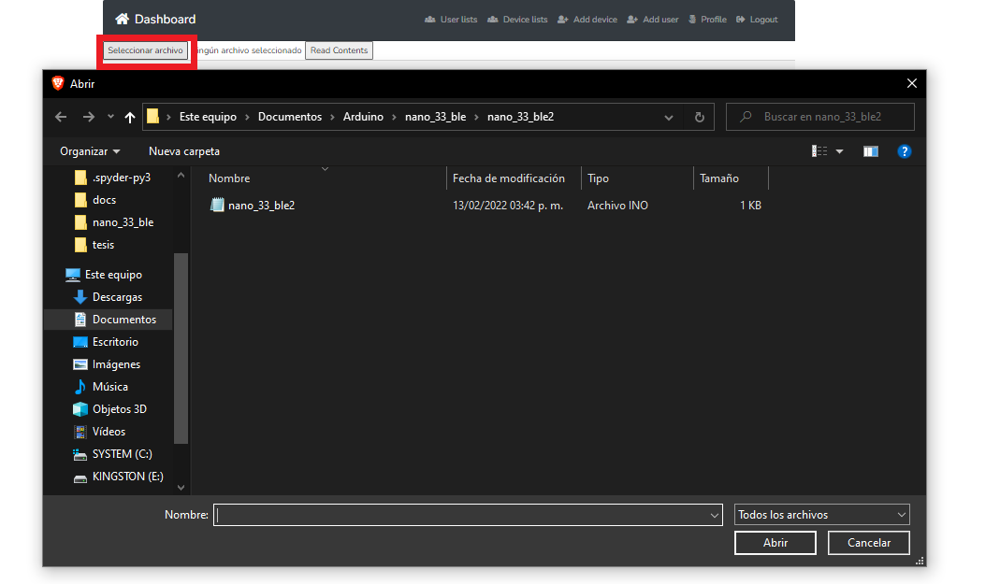
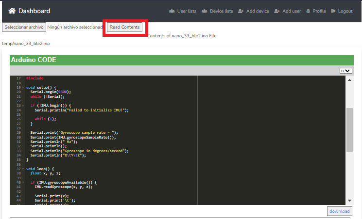
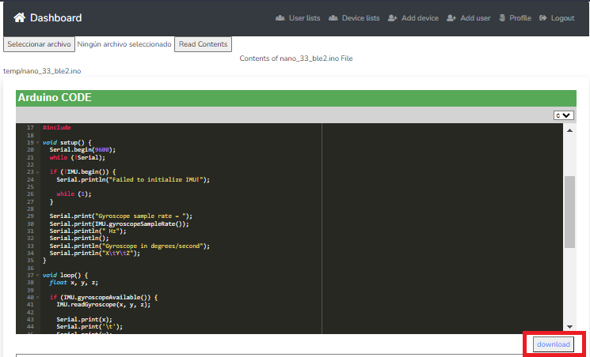
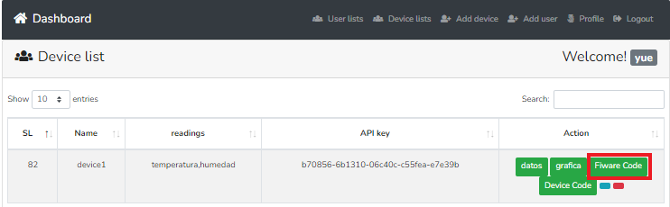
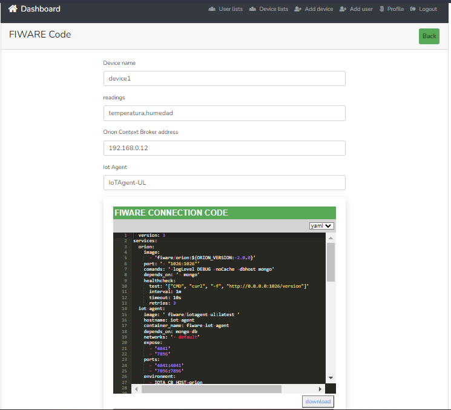
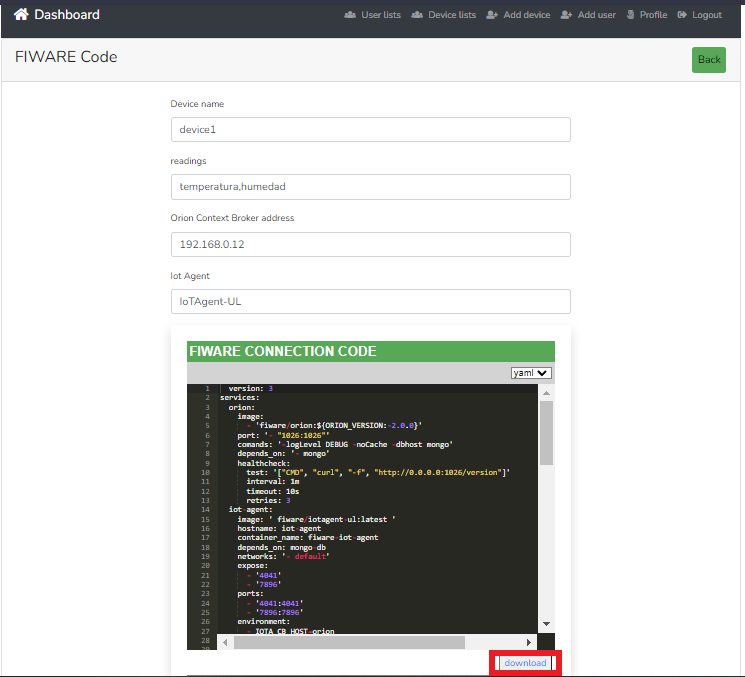

Módulo de conexión
===========

El módulo de conexión tiene como objetivo generar los códigos necesarios
para llevar a cabo la conexión entre dispositivos físicos y FIWARE. Esta
conexión se lleva a cabo utilizando los datos proporcionados por el
usuario (nombre del dispositivo, lectura, protocolo de comunicación,
agente del internet de las cosas y dirección del servidor de FIWARE).

Este módulo está compuesto por tres submódulos: (1)Generador de Código
para crear entidades NGSI, (2)Generador de Código para envío de
información, y (3)Generador de Código para la conexión con FIWARE.

Generador de código de entidades NGSI
-------------------------------------

El submódulo generador de código para crear entidades NGSI es el
encargado de generar el código para las entidades NGSI teniendo como
objetivo utilizar la información dada de alta por el usuario para
generar el código de cada entidad NGSI.

Generador de código de envío de información
-------------------------------------------
 
El submódulo generador de código para envío de información es el
encargado de generar el código arduino para el envío de información del
dispositivo físico al sistema web.
 
Paso 1- dar click en botón código arduino del dispositivo.

.. image:: images/device2.PNG

 
Paso 2- dar click en el botón seleccionar archivo, el cual abre un
explorador de archivos, donde el usuario debe subir su código arduino.
 

paso 3- dar click en el botón leer contenido, el cual despliega el
código arduino del usuario y agrega el código necesario para enviar
datos desde el dispositivo al sistema.
 

paso 4- dar click en el botón descargar el cual permite descargar el
código completo para su posterior compilación.
 

El código descargado debe de ser compilado en el ide de arduino para
empezar a enviar datos

Generador de código de conexión con FIWARE
------------------------------------------
 
El submódulo generador de código para la conexión con FIWARE es el
encargado de generar el código para la conexión entre el dispositivo y
FIWARE, para enviar los datos de los sensores representados en las
Entidades FIWARE.
 
Paso 1 Paso 1- dar click en botón código FIWARE del dispositivo.

 
El sistema despliega la información del dispositivo así como el código
en yaml necesario para realizar la conexión con fiware.

Paso 2 dar click en el botón de descargar.

