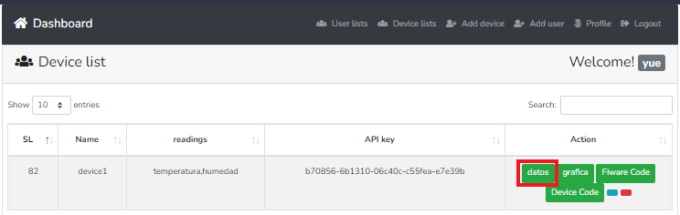
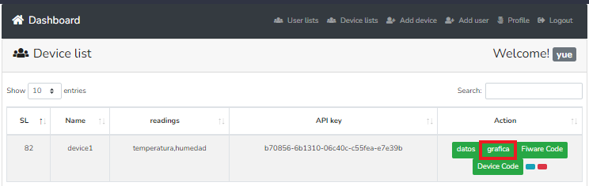

# Descripción

El módulo receptor de información, es el encargado de recibir los datos enviados por el dispositivo, almacenarlos en una base de datos, generar las suscripciones de los dispositivos y realizar la conexión con grafana.

Este módulo está compuesto por tres submódulos: (1)receptor, (2)Generador de suscripciones y (3) conexión con grafana.

## Submódulo receptor

El submódulo receptor es el  encargado de recibir y almacenar las lecturas del sistema: este módulo software genera una tabla para cada dispositivo, donde se almacenan las lecturas, el id y la fecha y hora en la que se recibieron los datos.
 (Para hacer uso de este modulo se requiere que el usuario compile el código arduino y el codigo de FIWARE el archvio .yml)

paso 1- Dar click en el boton de datos.

EL sistema despliega una tabla con las lecturas que se estan reciviendo del dispositivo desde arduino.

## Submódulo generador de suscripciones
El submódulo generador de suscripciones es el encargado de utilizar las entidades NGSI creadas en el módulo de conexión, para generar las suscripciones al orion context broker para guardar los datos históricos del dispositivo en una base de datos creada en CrateDB.

## Submódulo de conexión con grafana

El submódulo conexión con grafana es el encargado de crear la conexión con el módulo grafana de FIWARE con la finalidad de que el usuario pueda visualizar las lecturas de los dispositivos de manera gráfica con los datos almacenados en la base de datos de CrateDB.

Paso 2 dar click en el boton de gráfica del dispositivo.

**Si la grafica no es desplegada como en la imagen de arriba, seguir los pasos del manual de usuario del servidor de FIWARE para activar los permisos necesarios para desplegar la gráfica.**