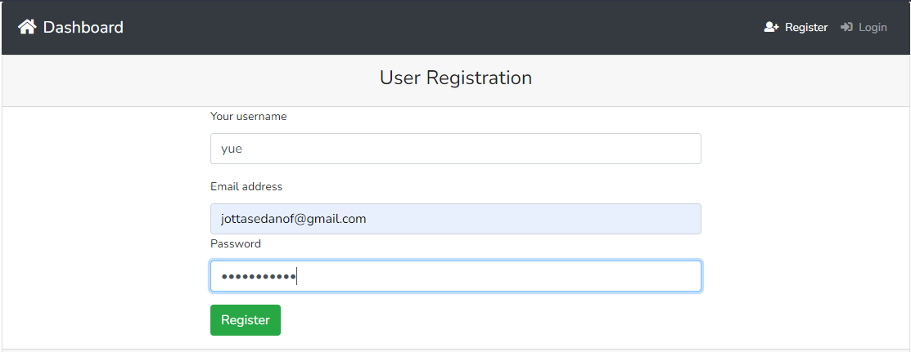
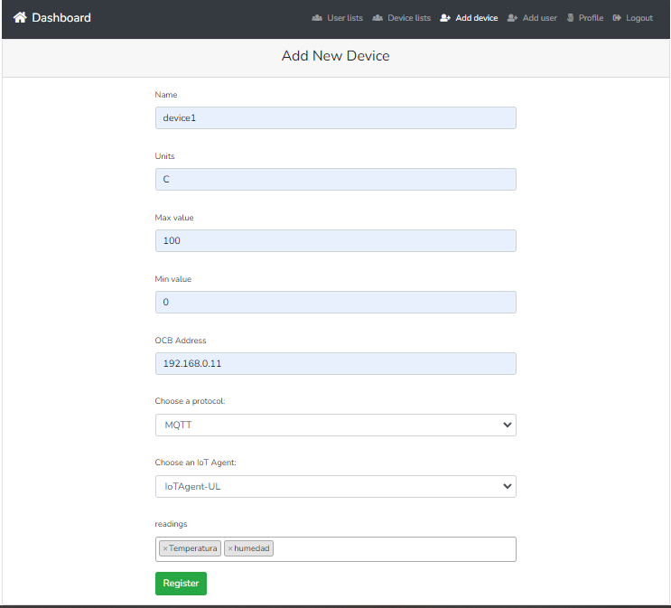

Módulo gestor
=============

Este módulo tiene como objetivo gestionar las características de los
sensores, la información de los usuarios, los aspectos de autenticación
y los detalles de la Nube FIWARE. Este módulo está compuesto por tres
submódulos: Gestión de usuarios, Gestión de dispositivos y Gestión de
autenticación. El submódulo de Gestión de Usuarios ofrece la
funcionalidad de registrar usuarios en el sistema. Los usuarios
esperados para este módulo son desarrolladores de IoT que querían crear
un sistema de IoT utilizando sensores conectados a FIWARE.

Registro
--------

El registro de usuario consta de dar la información necesaria para darse
de alta en el sistema.

Paso 1 ingresar los datos pedidos por el sistema como, nombre d
eusuario, correo y contraseña.

paso 2 una vez ingresados los datos dar click en el boton de registrar.

Inicio de sesión
----------------
 
El inicio de sesión consta de ingresar los datos que se dieron de alta
en el registro de usuario.
 
paso 3 ingresar el correo y contraseña.

.. image:: images/login.PNG

 
paso 4 dar click en el botón login.
 
Registro de dispositivo
-----------------------
 
El registro de dispositivos consta de otorgar la información necesaria
del dispositivo como: nombre, dirección del orion context broker,
protocolo de comunicación, agente IoT y las lecturas.
 
Paso 5 dar click en el botón agregar dispositivo.
 
paso 6 llenar el formulario del dispositivo.
 
paso 7 dar click en registrar.

