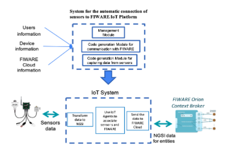

Introducción
============

Hoy en día, el Internet de las Cosas y la Inteligencia Artificial se
encuentran entre las tecnologías transformadoras más importantes. La
idea principal de Internet of Things es crear un entorno donde los
objetos se reconozcan a sí mismos y utilicen la información del contexto
para realizar comportamientos inteligentes. En este sentido, los objetos
pueden tomar decisiones considerando la información que pueden comunicar
sobre su contexto. Sin embargo, el Internet de las cosas enfrenta
desafíos importantes que podrían dificultar la realización de sus
beneficios potenciales. La complejidad de las soluciones en el Internet
de las Cosas ha requerido plataformas que ayuden a administrar y
combinar dispositivos físicos y sistemas de software. Algunas de estas
soluciones implementan tecnologías del Internet del Futuro basadas en
plataformas como: Google Cloud Platform, Amazon Web Services IoT o
FIWARE . La plataforma FIWARE ofrece componentes de software
(habilitadores genéricos) para realizar análisis de big data y provisión
de métricas en tiempo real, manipulación de información de contexto,
análisis de eventos en tiempo real, recopilación de información de
sensores y acción sobre actuadores. en esta plataforma las conexiones
entre dispositivos físicos y la nube mediante Agentes. Los agentes
permiten administrar grupos de dispositivos e integrar los datos que
recopilan en un flujo combinado y enviarlo de vuelta a las aplicaciones
inteligentes de Internet de las cosas. Actualmente, la configuración de
la conexión de los dispositivos a la nube FIWARE se realiza de forma
manual. Esto aumenta la complejidad para los desarrolladores no
calificados de aplicaciones inteligentes en el Internet de las cosas. La
dificultad de conectar un dispositivo o sensor con la plataforma FIWARE
podría aumentar con el uso de agentes. Sin embargo, cuando se crea una
conexión directa entre los sensores y el FIWARE, esto podría causar
serios problemas de seguridad. Este esquema de conexión directa se puede
romper permitiendo el acceso no autorizado a los datos de los sensores.
El objetivo de este artículo es presentar un nuevo enfoque que permita
la creación automática de componentes de software que gestionen la
comunicación entre dispositivos físicos y una plataforma IoT utilizando
el concepto de agentes. Este enfoque permite reducir la complejidad en
el desarrollo de aplicaciones de Internet de las Cosas. Nuestro enfoque
permite aislar a los desarrolladores de la configuración manual de los
componentes del software para ejecutar las siguientes acciones: (a)
obtener lecturas de datos de los sensores, (b) traducir los datos de los
sensores al formato FIWARE NGSI; (c) configurar un agente IoT
específico, y finalmente (d) establecer la conexión del Agente con la
Nube FIWARE. Este artículo está organizado de la siguiente forma: La
sección 2 muestra los antecedentes y el trabajo relacionado. La sección
3 presenta la descripción general del enfoque propuesto. La Sección 4
presenta nuestro enfoque de la conectividad entre sensores y FIWARE. La
Sección 5 muestra el sistema de software que implementa nuestro enfoque
propuesto y, finalmente, la Sección 6 detalla las conclusiones y el
trabajo futuro.

palabras clave
--------------

-  ``FIWARE`` - plataforma en la nube.
-  ``Internet de las cosas`` - grupo de dispositivos interconectados que
   comparten información.
-  ``Agentes IoT`` - puente entre dispositivos fisicos y fiware.

antecedentes
------------

Internet de las cosas
~~~~~~~~~~~~~~~~~~~~~

~~~~~~~~~~

Agentes IoT
~~~~~~~~~~~
